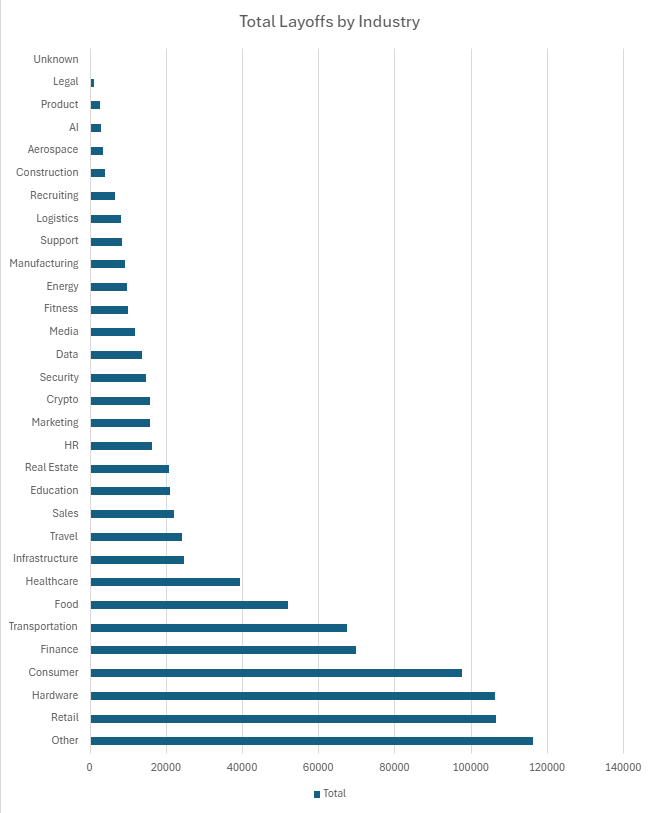
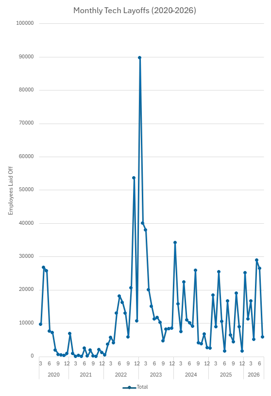

# Tech Layoffs Analysis (2020–2026)

**Tools:** MySQL, Excel
**Skills:** SQL, Data Cleaning, Business Analysis, Data Visualization

---

## What This Project Is

I looked at 4,494 tech industry layoff events from March 2020 through mid-2026 to answer three questions: which industries got hit hardest, when did layoffs actually peak, and how severe were individual events — not just in headcount, but as a share of each company's workforce.

**Dataset:** [Layoffs 2022 (Kaggle)](https://www.kaggle.com/datasets/swaptr/layoffs-2022) — company, industry, country, funding stage, and headcount data for layoffs across the tech sector.

## The Process

1. Loaded the raw CSV into MySQL and checked it for duplicates, blanks, and bad values.
2. Found that 16% of rows had no confirmed headcount — flagged them instead of deleting them, so they still count toward frequency without skewing totals.
3. Converted every column from text into proper number and date types.
4. Wrote SQL queries to answer specific questions, not just describe the data.
5. Built a dashboard in Excel so the results are easy to see, not just numbers in a table.

## What I found

### 1. Hardware, Retail, and "Other" lost the most jobs overall

| Industry | Total Laid Off |
|---|---:|
| Other | 116,330 |
| Retail | 106,706 |
| Hardware | 106,261 |
| Consumer | 97,699 |
| Finance | 69,912 |

**What this means:** Big single cuts (Intel and Oracle each laid off over 20,000 in one event) grab headlines, but they're not what actually drives these totals. It's the accumulation across many mid-sized companies in the same industry that adds up.

### 2. Layoffs spiked hard at the end of 2022

| Period | Monthly Layoffs |
|---|---:|
| Dec 2022 (peak) | ~90,000 |
| Jan 2023 | ~54,000 |
| Typical 2020-2021 month | under 5,000 |

**What this means:** 2020 and 2021 stayed relatively calm despite the pandemic. The real wave hit in late 2022, tied to the broader tech industry correction, not COVID itself.

### 3. The average layoff cut 29% of a company's workforce, but some were 100%

| Severity | % of Workforce Cut |
|---|---:|
| Average layoff | 29% |
| Full shutdown events | 100% |

**What this means:** A layoff labeled "100%" isn't a workforce reduction, it's a company closing entirely. That's a different kind of event than a company trimming a fifth of its staff, and it's worth reading separately in the data.

## What I'd tell a business to do

1. Treat Hardware, Retail, and Consumer tech as higher-volatility sectors when planning hiring or retention strategy.
2. Don't take layoff totals at face value — 16% of events in this dataset had no confirmed headcount, meaning real totals are likely higher than reported.
3. Separate full shutdowns from partial layoffs in any workforce-risk analysis; they signal very different things.

## Files In This Project

| File | What it is |
|---|---|
| `layoffs_project_queries.sql` | All the SQL — schema setup, data cleaning, and analysis queries |
| `layoffs_project.xlsx` | Cleaned dataset, pivot tables, and the final dashboard |
| `industry_layoffs_chart.png` | Chart showing total layoffs by industry |
| `monthly_layoffs_chart.png` | Chart showing the monthly layoff trend, 2020–2026 |

## What I'd Look Into Next

- Whether layoffs differ by company funding stage (Seed vs. Series C vs. Post-IPO).
- Whether the 731 unconfirmed-size events cluster in specific industries or time periods.
- Whether country plays a role — this analysis focused on industry and time, not geography.
