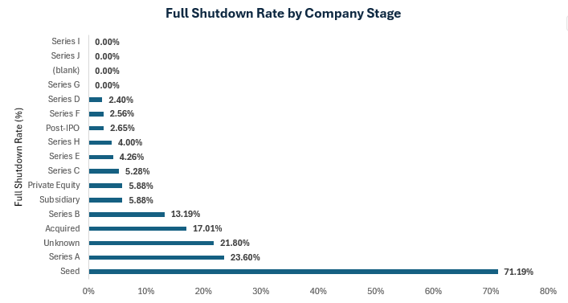
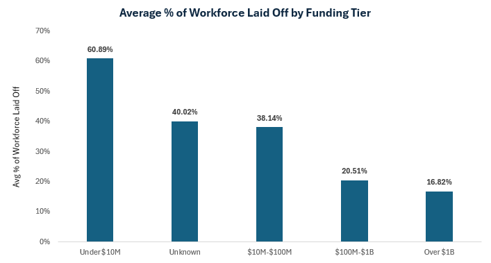
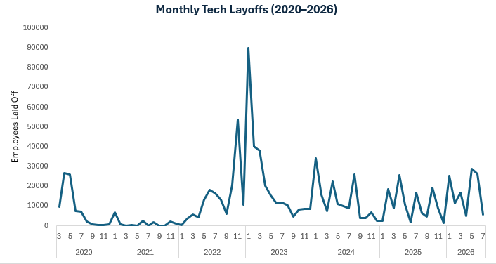
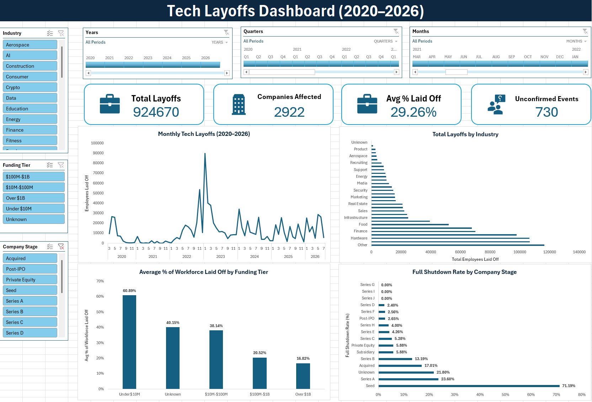
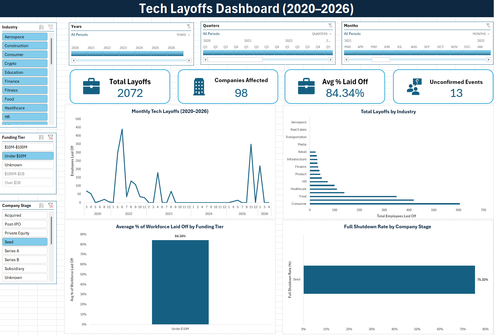

# Tech Layoffs Analysis (2020–2026)

**Tools:** MySQL, Excel (interactive dashboard with slicers and timeline)
**Skills:** SQL, data cleaning, data quality debugging, business analysis, dashboarding

---

## What this project is

I looked at 4,494 tech industry layoff events from March 2020 through mid-2026 to answer three questions: which industries got hit hardest, when did layoffs actually peak, and — the part that turned into the real finding — does a company's funding level or stage actually predict how severe its layoffs are, or is that assumption wrong.

**Dataset:** [Layoffs 2022 (Kaggle)](https://www.kaggle.com/datasets/swaptr/layoffs-2022) — company, industry, country, funding stage, and headcount data for layoffs across the tech sector.

## How I did it

1. Loaded the raw CSV into MySQL. Every column came in as text, including numbers and dates.
2. Checked for duplicates and cleaned blank/inconsistent values.
3. Found that 16% of rows had no confirmed headcount. Flagged them instead of dropping them, so they still count toward layoff frequency without skewing totals.
4. Converted all fields to proper types, and fixed a casting bug along the way (see below).
5. Wrote SQL to answer the core questions, then went further — bucketed layoffs by funding tier and company stage to test whether either one predicts outcome severity.
6. Caught and fixed two NULL-handling bugs that were quietly distorting those results (also below).
7. Built an interactive Excel dashboard — slicers, a year/quarter/month timeline, and live KPI cards — so the findings can be explored, not just read.

## What I found

### 1. Company stage predicts full shutdowns far better than industry does

| Stage | Full Shutdown Rate |
|---|---:|
| Seed | 71.2% |
| Series A | 23.6% |
| Series B | 13.2% |
| Post-IPO | 2.7% |

**What this means:** At Seed stage, a "layoff" in this dataset is usually a company closing entirely, not trimming staff. By Post-IPO, that's almost never true. I checked whether this was just an artifact of the 2022–2023 downturn skewing the Seed numbers — it isn't. Seed-stage shutdown events show up in nearly every year from 2020 to 2026, so this looks like a real pattern tied to company stage, not a specific bad year.

**One caveat worth being upfront about:** this measures outcomes *among companies that already had a layoff event* — it's not a survival rate across all Seed-stage companies. The dataset has no way to know how many Seed companies never laid anyone off at all.

### 2. More funding doesn't mean a safer layoff — it means a different kind of bad

| Funding Raised | Avg % of Workforce Cut | Avg Headcount Cut |
|---|---:|---:|
| Under $10M | 60.9% | 549 |
| $10M–$100M | 38.1% | 206 |
| $100M–$1B | 20.5% | 195 |
| Over $1B | 16.8% | 715 |

**What this means:** Well-funded companies do cut a smaller *share* of their workforce — but because they're bigger to start with, that smaller share still adds up to the highest average headcount loss of any tier. Funding doesn't protect jobs, it just changes whether the damage shows up as a high percentage or a high number.

### 3. Hardware, Retail, and "Other" lost the most jobs overall

| Industry | Total Laid Off |
|---|---:|
| Other | 116,330 |
| Retail | 106,706 |
| Hardware | 106,261 |
| Consumer | 97,699 |
| Finance | 69,912 |

**What this means:** Individual headline cuts (Intel and Oracle each laid off over 20,000 in a single event) aren't what drives these totals — it's the accumulation across many mid-sized companies in the same industry.

### 4. Layoffs spiked hard at the end of 2022

A single month peaked at roughly 90,000 people laid off — more than double any other point in the dataset. 2020 and 2021 stayed relatively calm despite the pandemic; the real wave hit in late 2022, tied to the broader tech industry correction rather than COVID itself.

## Two data quality bugs I caught mid-analysis

Both are worth flagging because they're the same root cause showing up twice, and both would have quietly produced a wrong headline number if I hadn't checked.

1. **Funding tier bucket:** the first version of the `CASE` statement bucketing companies by funding didn't account for `NULL` values. Any row with no funding data silently fell into the `ELSE` branch and got labeled "Over $1B" — mixing companies with no funding info at all into the same bucket as actual billion-dollar companies, and dragging that tier's average down. Fixed by adding an explicit `NULL` check and giving those rows their own "Unknown" label.

2. **Shutdown flag:** same issue, different query. `CASE WHEN percentage_laid_off_num = 1.00 THEN 1 ELSE 0 END` treated `NULL` as "not a shutdown" instead of excluding it, which diluted every stage's real shutdown rate. Fixed by explicitly passing `NULL` through instead of defaulting to 0.

Fixing both changed the Seed shutdown rate from ~56% to the correct 71.2%, and the Over-$1B tier's average from ~29% to the correct 16.8% — not small rounding differences, real distortions that would have misrepresented the findings.

## The dashboard

Built in Excel with three slicers (Industry, Funding Tier, Company Stage) and a Year/Quarter/Month timeline, all connected to four live KPI cards and four charts. Filtering by any slicer updates everything at once.

*Filtered to Seed-stage layoffs — Companies Affected, Avg % Laid Off, and the shutdown chart all update to isolate that stage's pattern.*

## What I'd tell a business to do

1. Treat company stage, not just industry, as a real risk signal — Seed-stage layoffs behave completely differently from Post-IPO ones, and lumping them together hides that.
2. Don't assume a well-funded company is a safer bet for job security. It just changes the shape of the risk, not whether it exists.
3. Don't take layoff totals at face value — 16% of events in this dataset had no confirmed headcount, meaning real totals are likely higher than reported.

## Files in this repo

| File | What it is |
|---|---|
| `layoffs_queries.sql` | All the SQL — schema setup, data cleaning, core analysis, and the deeper funding/stage analysis |
| `layoffs_dashboard.xlsx` | Cleaned dataset, pivot tables, and the interactive dashboard |

## What I'd look into next

- Whether industry and stage are confounded — for example, if Seed-stage companies cluster in already-volatile industries like Crypto or AI, that could be part of what's driving the shutdown rate, not stage alone.
- The 731 unconfirmed-size events — whether they cluster in specific industries or time periods.
- Country-level patterns, since this analysis focused on industry, stage, and time.
